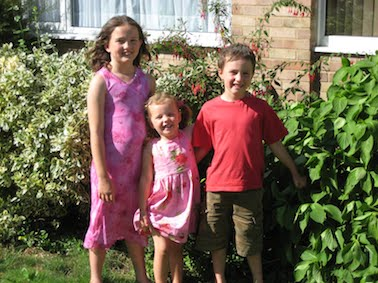

```{r setup, include=FALSE}
knitr::opts_chunk$set(echo = TRUE)
```

## Example portfolio

This project presents a statistical analysis of a photograph album, which I took on August 2008.
The dataset shows which of my three children were in each photograph.  The figure below shows one of the photographs from the album, this one with all three children in it.  I enjoyed our vacation but found it difficult to take photos of the children, who sometimes did not want to be photographed.

{width=250px}


The dataset used has 32 rows and three columns.  Each row corresponds to a photograph in the album and each column to a child:

```{r}
a <- as.matrix(read.table("chi.txt",header=TRUE))
head(a)
```

thus in the first and second photographs, all three children were in the photo, (three ```TRUE``` entries), but in the third, Alice was not present but Zac were but Annabel were, and so on.  First I will analyse whether the number of children present in the photgraphs was a binomial distribution with size 3.

```{r}
table(rowSums(a))
```

thus 3 photos had zero children in them (landscapes), 13 had one child, and so on.
The estimated probability of a child being present is thus

```{r}
p <- sum(a)/(3*nrow(a))
p
```

or a little over 57%.  On the (null) assumption of binomially distributed number of childern we would have

```{r}
e <- nrow(a)*dbinom(0:3,3,0.573)
e
```

and the chi-square statistic B would be

```{r}
o <- c(table(rowSums(a)))
B <- sum((o-e)^2/e)
B
```

with significance

```{r}
pchisq(B,df=4-1-1,lower.tail=FALSE)
```

Thus we have strong evidence to suggest that the distribution of the number of children is not binomial.  Looking at the table we see that there are very few photos with exactly two children in them which may explain the discrepancy.

### Column sums

We now test whether each child is equally likely to appear in a photo:

```{r}
colSums(a)
```


It is natural to suggest that these numbers are equal and we can test this using another chi-square:


```{r}
o <- colSums(a)
e <- rep(sum(a)/3,3)
e
```

thus we would expect each child to be in a little over 18 photos.  But the chi-square statistic B:

```{r}
B <- sum((o-e)^2/e)
B
```

then the p-value would be

```{r}
pchisq(B,df=4-1,lower.tail=FALSE)
```

indicating that we may not reject the null and it is reasonable  to suppose that all three children have the same probability of appearing in a photo.

### Logistic regression

It is possible that the number of children present decreases with time:

```{r}
p <- seq_len(nrow(a))
plot(p,rowSums(a),ylab='number of children',xlab='index of photo')
```

Perhaps there is a tendency of the number of children to decrease as we follow the album.  We can test this by using logistic regression:

```{r}
summary(glm(c(a)~c(p,p,p),family="binomial"))
```

The p-value of 0.0825 would show that there is no evidence for a change in probability with time.  However, it might be argued that we have a one-sided test (the kids got more badly-behaved as the holiday progressed) in which case the p-value would be borderline significant.

## Summary and conclusions

This portfolio has analysed a dataset of 32 family photographs of an album for statistical patterns.  Although each of the three children appear with equal probability (p=0.78), the number of children is not binomially 
distributed (chi square, p=0.024).  It seems that the children are not independent and we can see that only a small number of photos have exactly two children in them: most photos had either one or three children in them.  Perhaps the photos with all three were the result of bribery.

The photographs show a slight, but statistically significant, trend in time: later photographs have a smaller number of children in them (one-sided logistic regression, p=0.043).  It seems as though bribery becomes less effective with time.

